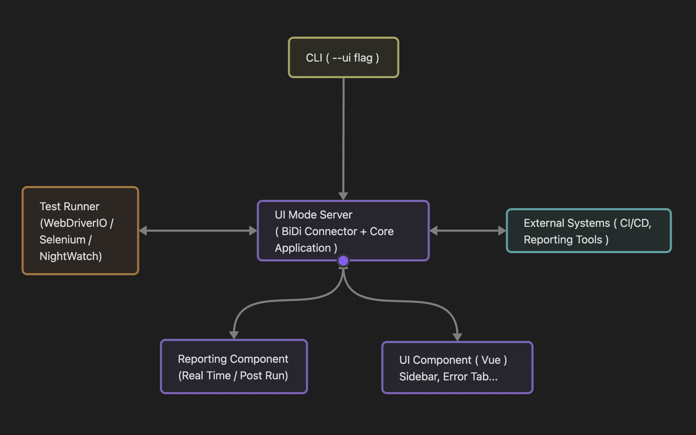

# BiDi Vision Design

UI Mode enables developers to debug and introspect tests interactively through a web interface, supporting frameworks like WebdriverIO, Selenium, and Nightwatch. It uses WebDriver BiDi for real-time communication, with fallbacks to classic WebDriver, and includes a `--ui` flag for launching the interface. The system processes test execution, captures events, and displays results in a Vue-based UI, with reporting for real-time and historical analysis. This document provides a high-level overview of the components, their interactions, and the data flow, designed to help contributors understand the architecture 

## System Components

- **Test Runner**: Executes tests using frameworks (WebdriverIO, Selenium, Nightwatch), emitting framework-specific events and BiDi events
- **BiDi Connector**: Manages WebSocket connections to the WebDriver session, subscribing to BiDi events and falling back to classic WebDriver for unsupported features
- **Core Application**: Orchestrates sessions, maps framework events to a unified model, exposes REST APIs and WebSocket for UI communication, and integrates with reporting
- **UI Component**: A Vue-based web interface rendering tabs (e.g., Test Sidebar, DOM Inspector) for user interaction, updated via WebSocket
- **Reporting Component**: Aggregates test data, propagates real-time metrics to the UI, stores historical data in SQLite, and exports to supported tools

## Design Flow

### Workflow

1. **Initiation**:
   - The user runs a command with the `--ui` flag (e.g., `npx wdio run wdio.conf.js --ui` for WebdriverIO)
   - The UI Mode server starts at `http://localhost:8080` and initializes the Test Runner

2. **Connection**:
   - The Test Runner creates a WebDriver session with `webSocketUrl: true` for BiDi support
   - The BiDi Connector establishes a WebSocket connection, subscribing to BiDi events 

3. **Test Execution**:
   - The Test Runner executes tests, emitting framework events and BiDi events
   - The BiDi Connector forwards events to the Core Application

4. **Data Processing**:
   - The Core Application updates session state, maps framework events to a generic model, and broadcasts data to the UI Component via WebSocket
   - It logs results to the Reporting Component for storage and analysis

5. **UI Interaction**:
   - The UI Component renders data in tabs (e.g., Test Sidebar shows test tree, Network Tab shows requests)
   - Users interact, sending commands to the Core Application via REST or WebSocket
   - The Core Application relays commands to the BiDi Connector, executed via BiDi or classic WebDriver
   - The resulting data is sent back to the Core Application and subsequently to the UI Component for display

6. **Reporting**:
   - The Reporting Component propagates real-time metrics to the UI Component
   - It stores historical data in SQLite and exports reports to JSON or third-party tools

7. **External Integration**:
   - Exports test data to reporting tools and integrates with CI/CD pipelines

## Why This Design?

- **Modularity**: Components are loosely coupled, allowing independent development
- **Compatibility**: Supports WebdriverIO, Selenium, and Nightwatch via a generic Core Application and BiDi Connector
- **Real-Time**: WebSocket-based updates ensure responsive debugging, aligning with focus on real-time feedback

## TL;DR
BiDi Vision’s UI Mode, launched via a `--ui` CLI flag, enables real-time test debugging for WebdriverIO, Selenium, and Nightwatch using WebDriver BiDi (with classic WebDriver fallbacks). The UI Mode Server at `http://localhost:8080` coordinates the Test Runner, BiDi Connector, Core Application, UI Component, and Reporting Component. Tests execute via a WebDriver session, with events forwarded through WebSocket to the Core Application, which updates state, broadcasts to the Vue-based UI’s tabs (Test Sidebar, Network Tab), and logs to the Reporting Component for real-time metrics and JSON exports. The system extends integrations with CI/CD and reporting tools